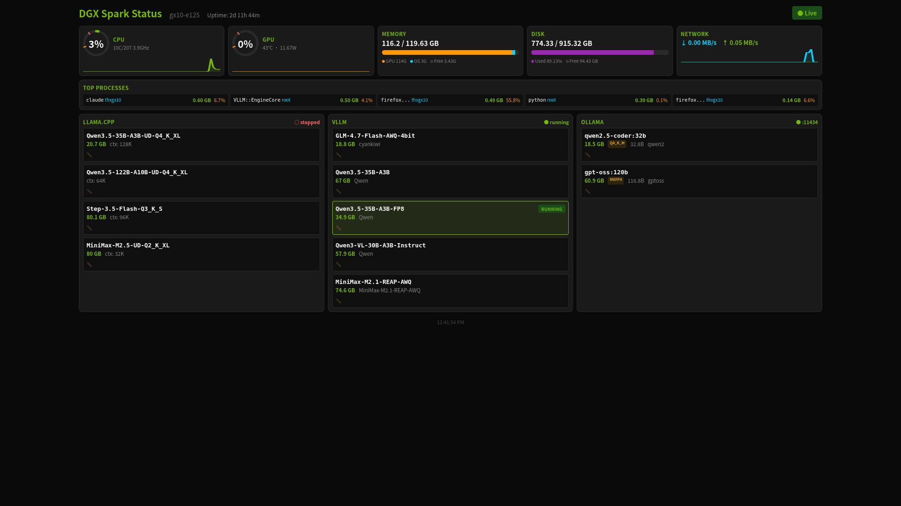

# DGX Spark Status Dashboard

Real-time system monitoring dashboard for NVIDIA DGX Spark (GB10) with comprehensive GPU, CPU, memory metrics and inference engine management.



## Features

### System Monitoring
- **CPU Metrics** - Real-time CPU usage with per-core monitoring, brand info, and thread count
- **Memory Tracking** - Total, used, free, and active memory with percentage gauges
- **GPU Monitoring** - NVIDIA GPU utilization, memory, temperature, and power draw via nvidia-smi
- **Disk Usage** - Multi-partition disk monitoring with usage percentages
- **Network I/O** - Real-time network throughput (upload/download speeds)
- **Process Monitoring** - Top memory-consuming processes with CPU usage
- **System Uptime** - Days, hours, and minutes since boot

### Inference Engine Integration
- **llama.cpp** - Server status monitoring (port 8001), loaded model info
- **vLLM** - Container-based model serving status, running model detection
- **Ollama** - Model management: load/unload, pull, delete models

### UI Features
- **Circular Gauges** - Clean visualization with yellow (70%) and red (90%) threshold indicators
- **Live Updates** - Server-Sent Events (SSE) for real-time metrics streaming (1s interval)
- **Responsive Grid** - Auto-fitting card layout that adapts to screen size
- **Dark Theme** - Professional dark interface optimized for 24/7 monitoring
- **Model Cards** - Visual model inventory across all inference engines

## Prerequisites

- **Node.js** v25+ (via nvm recommended)
- **NVIDIA GPU** with nvidia-smi installed
- **Linux** - Tested on Ubuntu 24.04 (ARM64 / DGX Spark GB10)
- **Ollama** (optional) - For LLM model management features

## Quick Start

```bash
# Clone the repository
git clone https://github.com/thx0701/dgx-spark-status.git
cd dgx-spark-status

# Install dependencies
npm install

# Start development server
npm run dev
```

Dashboard will be available at `http://localhost:9000`

### Production

```bash
npm run build
node server.js
```

### Systemd Service

```bash
sudo cp dgx-dashboard.service /etc/systemd/system/
sudo systemctl enable --now dgx-dashboard
```

## Configuration

### Update Interval
Modify `UPDATE_INTERVAL` in `dev-server.js`:
```javascript
const UPDATE_INTERVAL = 1000; // milliseconds
```

### Port
Development server runs on port 9000 by default. Change in `dev-server.js`:
```javascript
server: { host: '0.0.0.0', port: 9000 }
```

### Inference Engines
Configure endpoints in `dev-server.js`:
```javascript
const OLLAMA_API = 'http://localhost:11434';
// llama.cpp: port 8001
// vLLM: auto-detected via Docker containers
```

## Technology Stack

- **SvelteKit 2** - Full-stack framework with SSR
- **Svelte 5** - Reactive UI with modern runes syntax
- **Vite 7** - Fast build tool and dev server
- **Express** - SSE middleware
- **systeminformation** - Cross-platform system metrics
- **nvidia-smi** - Direct GPU querying
- **Server-Sent Events** - Real-time streaming protocol

## Project Structure

```
dgx-spark-status/
├── src/
│   ├── lib/
│   │   ├── SystemMetrics.svelte  # Main dashboard component
│   │   ├── Gauge.svelte          # Circular gauge component
│   │   └── websocket.js          # SSE client handler
│   └── routes/
│       └── api/
│           ├── metrics/+server.js  # SSE metrics endpoint
│           └── ollama/+server.js   # Ollama management API
├── dev-server.js           # Development server with SSE
├── server.js              # Production server
├── start.sh              # Startup script with nvm
└── package.json
```

## API Endpoints

### GET /api/metrics
Server-Sent Events stream providing real-time system metrics every second.

### POST /api/ollama
Ollama model management endpoint.

**Actions:** `pull` | `delete` | `load` | `unload`

## Credits

Originally created by [Phanes](https://github.com/Viroscope) @ [OnticEntia.ai](https://github.com/Viroscope)
Extended with inference engine integration (llama.cpp, vLLM) and UI improvements by [thx0701](https://github.com/thx0701)

## License

MIT

---

# DGX Spark 系統監控面板

NVIDIA DGX Spark (GB10) 即時系統監控面板，提供完整的 GPU、CPU、記憶體監控以及推論引擎管理功能。

## 功能特色

### 系統監控
- **CPU 監控** - 即時 CPU 使用率，支援逐核心監控
- **記憶體追蹤** - 顯示總量、已用、可用記憶體及使用百分比
- **GPU 監控** - 透過 nvidia-smi 監控 GPU 使用率、記憶體、溫度及功耗
- **磁碟使用** - 多分割區磁碟空間監控
- **網路 I/O** - 即時上傳/下載速度
- **程序監控** - 顯示最耗記憶體的 Top 程序
- **系統運行時間** - 天、時、分顯示

### 推論引擎整合
- **llama.cpp** - 伺服器狀態監控（port 8001）
- **vLLM** - 容器化模型服務狀態監控，自動偵測執行中的模型
- **Ollama** - 模型管理：載入/卸載、下載、刪除模型

### 介面特色
- **圓形儀表** - 清楚的視覺化，黃色(70%)和紅色(90%)警示門檻
- **即時更新** - 透過 Server-Sent Events (SSE) 每秒串流更新
- **響應式排版** - 自動適應螢幕大小的卡片式排版
- **深色主題** - 專為 24/7 全天候監控設計
- **模型卡片** - 視覺化顯示所有推論引擎中的模型清單

## 快速開始

```bash
git clone https://github.com/thx0701/dgx-spark-status.git
cd dgx-spark-status
npm install
npm run dev
```

開啟瀏覽器前往 `http://localhost:9000` 即可使用。

## 硬體環境

- **DGX Spark GB10** - NVIDIA Blackwell 行動版，128GB 統一記憶體，ARM64
- **作業系統** - Ubuntu 24.04
- **GPU Driver** - 580.x+

## 致謝

原始專案由 [Phanes](https://github.com/Viroscope) @ [OnticEntia.ai](https://github.com/Viroscope) 建立。
推論引擎整合（llama.cpp、vLLM）及 UI 改進由 [thx0701](https://github.com/thx0701) 擴充。
